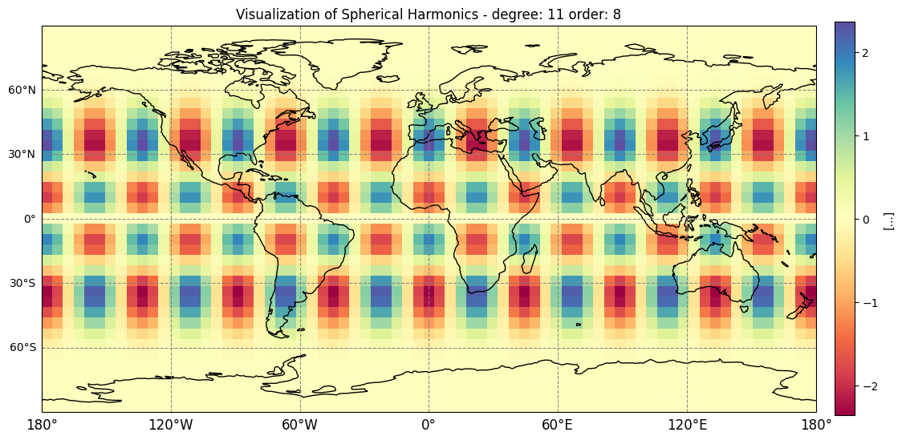
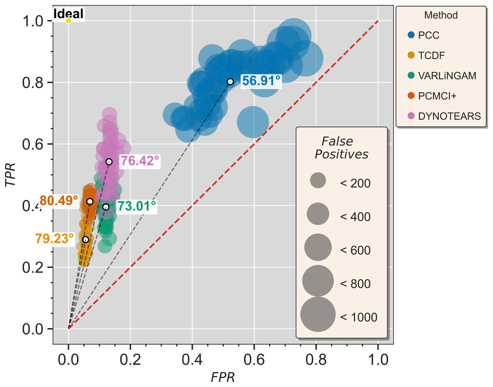

# Vivek Kumar Yadav

Joint PhD candidate in the [Melbourne India Postgraduate Academy (MIPA)](https://research.unimelb.edu.au/strengths/initiatives/international-training-groups/melbourne-india-postgraduate-academy-mipa).

I am interested in terrestrial water storage, Earth system modelling, and causality.

📍 University of Melbourne, Australia  
🎓 Indian Institute of Science (IISc), Bengaluru  
🇮🇳 India

## Selected Works

<table>
  <tr>
    <td width="50%" valign="top">
      
        
      <strong><a href="https://doi.org/10.21105/joss.07550">PySHbundle</a></strong> 
      <em>Journal of Open Source Software</em> (2026)  
      A Python package for processing GRACE Level-2 gravimetry data into global surface-mass-change datasets.
    </td>
    <td width="50%" valign="top">
      
        
      <strong><a href="https://hess.copernicus.org/articles/30/3455/2026/">Cause-effect discovery in hydrometeorological systems</a></strong> 
      <em>Hydrology and Earth System Sciences</em> (2026)  
      An evaluation of causal-discovery methods that identifies parsimonious drivers and supports robust hydrometeorological prediction.
    </td>
  </tr>
</table>

All publications: [Google Scholar](https://scholar.google.co.in/citations?user=Y-B0GUoAAAAJ&hl=en&oi=ao)

## Contact

Have a question? Send me an email :)

Email: viveky [at] iisc.ac.in · vivekkumarya [at] student.unimelb.edu.au  
LinkedIn: [lsm-vivek](https://www.linkedin.com/in/lsm-vivek/) · GitHub: [@lsmvivek](https://github.com/lsmvivek)
